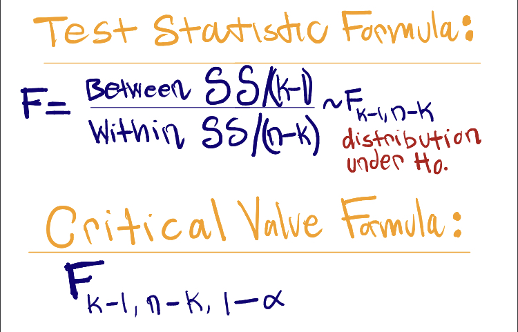
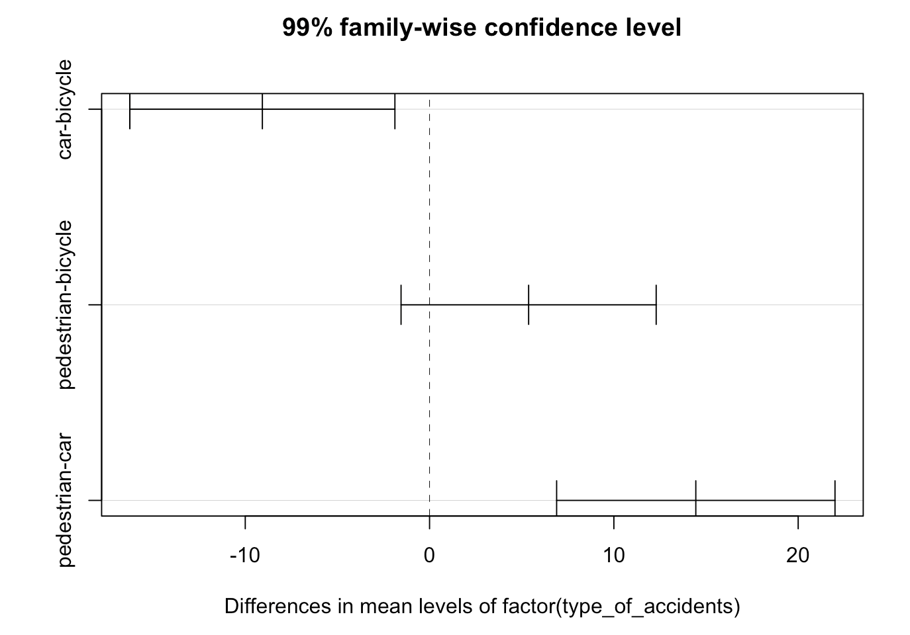
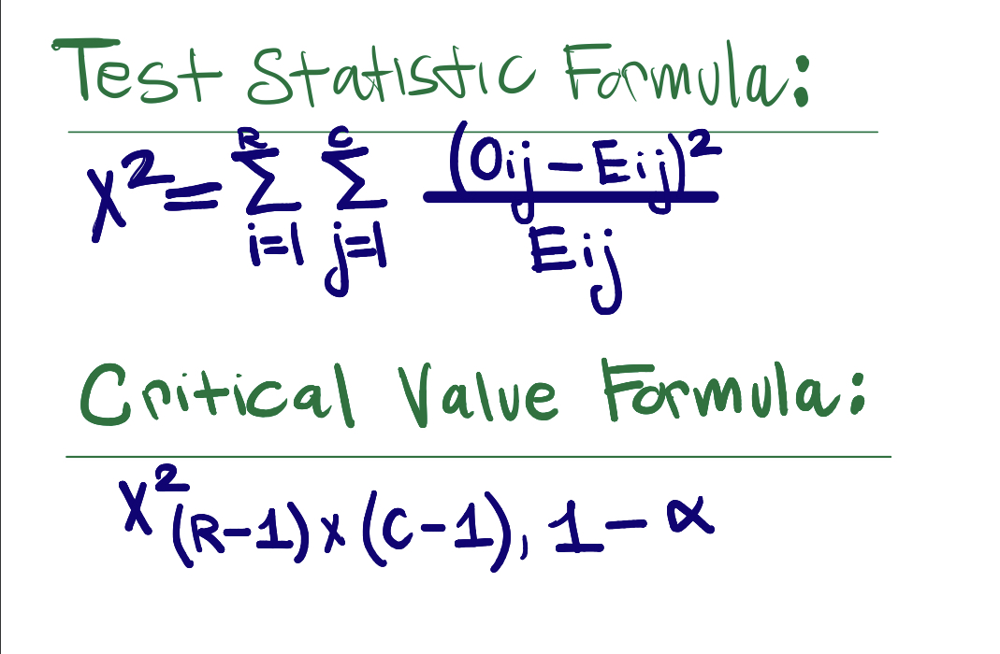
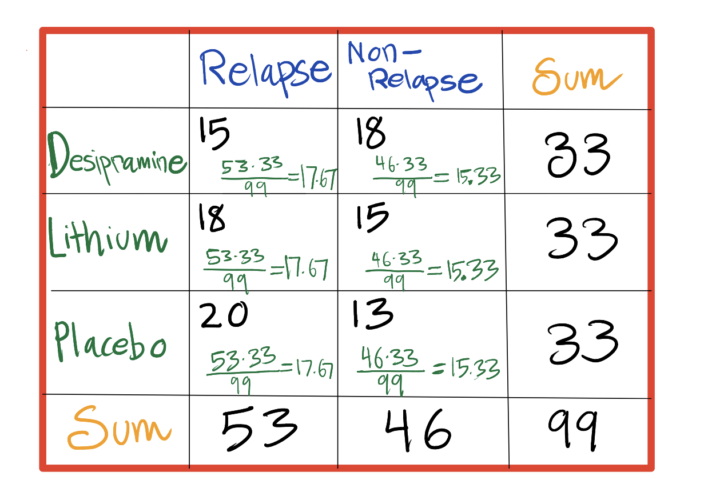

```{r echo = FALSE, message = FALSE}
library(tidyverse)
library(multcomp)

update.packages(ask = FALSE, checkBuilt = TRUE)
tinytex::tlmgr_update()
```


# Problem 1
```{r echo=FALSE, fig.align="center", out.width = '50%'}
knitr::include_graphics("problem1.jpeg")
```


\newpage


# Problem 2 


### Loading the Crash data 
```{r}
crash_df <- 
  read.csv("Crash.csv")
```


### Tidying the data 
```{r warning = FALSE}
crash_dfn <-
  crash_df %>%
  pivot_longer(everything(), 
               names_to = "type_of_accidents",
               values_to = "Values")
```


# Problem 2a
### Generating Descriptive statistics for each group: 
```{r warning = FALSE}
crash_df %>% 
  summary() %>% 
  knitr::kable(caption = "Mean, Median, Min, Max, 1st & 3rd Quartile Values for each type of crash")
```


```{r warning = FALSE}
crash_df %>% 
  summarize_if(is_numeric, sd, na.rm = T) %>%
  knitr::kable(caption = "*Standard deviation* for each type of crash")
```


```{r warning = FALSE}
crash_dfn %>% 
  group_by(type_of_accidents) %>% 
  summarise(n = n(), mean = mean(Values, na.rm = T), 
            sum = sum(Values, na.rm = T), variance = var(Values, na.rm = T)) %>%
  knitr::kable(caption = "Mean, Variance for each type of crash")
```


```{r}
boxplot(Values ~ type_of_accidents, data = crash_dfn,
        main = "Distribution of PTSD score for each type of crash",
        xlab = "Types of Accident",
        ylab = "PTSD Score")
```


### Analysis of Differences Observed:
In the data set that was provided, the mean of the PTSD Score for Pedestrian Incidents  (37.88) is the largest among the three types of accidents. The mean of the PTSD Score of bicycle incidents (32.50) is the second highest and the mean of the PTSD Scores for car incidents (23.43) is the lowest. The standard deviation for PTSD score for pedestrian incident is 5.44, the standard deviation for PTSD score in bicycle incident is 4.06, and the standard deviation for the PTSD score for car crash is 3.87. Pedestrian has a larger standard deviation than bicycle and car. This indicates that the PTSD score for the pedestrian incidents is more spread out compared to the other two types if crash. When pedestrians is involved in an incident, their PTSD  score in general is more varied compared to the other groups (bicycle and cars). Pedestrian group has the largest standard deviation compared to the other two groups (bicycle and car) and a large standard deviation indicates that the data points are far from the mean. The car group has the smallest standard deviation compared to the other two groups (pedestrian and bicycle), which indicates that the data points are clustered closely around the mean. 

Furthermore, the boxplot shows that pedestrian and bicycle crash group has medians over 30, while car crash group has median lower than 30. The boxplot shows that there is an outlier in the car accident group. Also, the boxplot for the pedestrian group is somewhat left-skewed, while the the boxplot for the bicycle and car group is somewhat right-skewed. 


\newpage 


# Problem 2b: 

### Equations that will be used for problem 2b:
```{r echo=FALSE, fig.align="center", out.width = '50%'}

```

### Assumptions for One-Way ANOVA;

1. There are *k* populations of interest (k>2): **k = 3**

2. The samples are drawn independently from the underlying populations: 

3. *Homoscedasticity:* the variances of the *k* populations are equal;

4. *Normality:* the distributions of the error terms are normal: 
**The problem states it is normally distributed.** 

**The problem does not mention to state the assumptions, but I asked the professor and the professor emailed me and the professor stated it is good practice to write the assumptions. Also the problem does not mention specific things, we assume these assumptions are met to continue with the test because in problem 2b it states to obtain "ANOVA table".**

#### ANOVA TABLE 
```{r}
res1 = aov(Values ~ factor(type_of_accidents), data = crash_dfn) 
summary(res1) 
```
 
 
 


```{r}
# Using R-code to obtain critical value 
critical_value = qf(0.99, 2, 22)
```

**Interpretation**: 

**Hypothesis:**

**Ho:** mu1 = mu2 = mu3

**Ha:** at least two means are not equal 

**Test-Statistics:**
F-Value: 19.53 -> *Obtained from ANOVA table that was created above.*

**Critical Value:**
Critical Value: `r critical_value` -> *Obtained from R-code above qf().*

**Interpretation in context to our problem:**
Our F-statistics (19.53) is bigger than our critical value (5.72), we reject the null hypothesis. At 0.01 significance level, we reject the null hypothesis and conclude that at least two of true mean PTSD score from the three type of crash groups are different. 


\newpage


# Problem 2c:
```{r}
Tukey_comp = TukeyHSD(res1, conf.level = 0.99)
Tukey_comp
```

**Analysis:** We will be using be Tukey's adjustment since Bonferroni is a conservative method and gives us less power while Tukey's method controls for all pairwise comparisons and it is less conservative. Based on our Tukey's adjustment method, it is indicated that the the true mean PTSD score for car and bicycle is different since the adjusted p-value for car-bicycle pairwise is 0.00134 which is smaller than our alpha 0.01. Also the the true mean PTSD score for pedestrian and car is different since the adjusted p-value for pedestrian-car pairwise is 0.0000088 which is smaller than our alpha 0.01. *Based on the Tukey's method, we do not have enough evidence to state that the true mean PTSD score for pedestrian-bicycle pairwise is different*. *It is important to note that in lecture, we did not go over assumptions for the Tukey and Bonferroni methods. I emailed the professor and the professor stated that either Tukey or Bonferroni will be valid to use for this problem.* 


\newpage


```{r}
plot(Tukey_comp)
```
**Some reason the code did not output the middle label, it should be pedestrian-bicycle.** I posted a picture below of what the output should be with the correct label. 

```{r echo=FALSE, fig.align="center", out.width = '50%'}

```

\newpage


# Problem 2d:
Based on the data set provided for each type of crash (bicycle, car, pedestrian), our statistical analysis indicated that the mean PTSD score for pedestrian is 37.88 and the mean PTSD score bicycle crash is 32.5. It has been reported by the National Center for PTSD that a PTSD score of 31-33 or higher suggest the patient may benefit from PTSD treatment. Emergency Department physicians may provide additional resources or a better catered treatment plan to individuals involved in pedestrian and bicycle incidents/crashes for reducing their PTSD symptoms. In our statistical analysis, the mean PTSD score for car is 23.43 and it has been reported by the National Center for PTSD that scores lower than 31-33 may indicate the patient either has sub threshold symptoms of PTSD or does not meet criteria for PTSD. Emergency department physicians should be aware of which type of crash group on average has higher PTSD score. Emergency department physicians should give proper or more medical resources to those groups (which in this case is pedestrian and bicycle group). Furthermore, our statistical finding indicates that we do not have enough evidence to state that pedestrian and bicycle mean for PTSD score are different. In both groups, the calculated mean and median PTSD score is above 31 and the emergency department physicians need to provide additional treatment towards these two groups (pedestrian and bicycle incidents) so that these individuals have less difficult time in recovering after being involved in or experiencing a terrifying crash. 


\newpage 


# Problem 3a:
The appropriate test I used to address this question of interest is **Chi-Squared of Independence**. Our observational units are collected at random from a population, we are not gathering the data by randomly sampling from each sub-group separately, which is the case of Chi-Squared Test for Homogeneity. Also, we have two categorical variables (relapse and non-relapse) that are being observed for each unit (desipramine users, lithium users, and placebo users). We're interested in whether the knowledge of one variable (type of antidepressants drug) value provides an information about the value of the other variable (relapse status), i.e. are these two variables independent. Chi-Squared of Homogeneity assesses whether the pattern of relapse was different between the three groups of antidepressants. 

### Equations that will be used for problem 3:
#### Under the null hypothesis: 
```{r echo=FALSE, fig.align="center", out.width = '50%'}

```
**We do not need to use Yates' Continuity Correction, since that correction is only for 2x2 tables.**

**Assumptions for Chi-Squared**:

1. Independent Random Sample: Question states "randomly assigned"

2. No expected cell counts are 0, and no more than 20% of the cells have an expected count less than 5: *After creating the table, there is no cells with values of 0 and there is no cells with values less than 5.*


\newpage 


Problem 3b:

### Chi-Squared: Test of Independence Table 
```{r echo=FALSE, fig.align="center", out.width = '50%'}

```

### We may use R-code to get the Chi-Squared: Test of Independence Table 
```{r}
antidepressant_df = matrix(c(15, 18, 18, 15, 20, 13), nrow=3,ncol=2,byrow=T,
                  dimnames = list(c("Desipramine","Lithium","Placebo"), 
                                  c("Relapse","Non-Relpase")))

antidepressant_dfa = addmargins(antidepressant_df)
antidepressant_dfa %>% knitr::kable()
```


\newpage 

# Problem 3c:
```{r}
#Using R code to get test-statistics, p-value, degrees od freedom
new_var = chisq.test(antidepressant_df)
new_var
new_var$expected %>% knitr::kable()
```


```{r}
#Test Statistics 
test_statistic = (15-17.67)^2/17.67 + 
  (18-17.67)^2/17.67 + (20-17.67)^2/17.67 + 
  (18-15.33)^2/15.33 + (15-15.33)^2/15.33 + (13-15.33)^2/15.33
```

```{r}
#Critical Value 
critical_value = qchisq(.95, 2)
```

```{r}
#p-value
pval = pchisq(test_statistic, 2, lower.tail = FALSE)
```

*Hypotheses:*

**Ho:** Relapse and the type of anti-depressant drug are independent (p1=p2=p3)

**Ha:** Relapse and the type of anti-depressant drug are associated/dependent 

**Test Statistics:**
The test statistic is: `r test_statistic`

**Critical Value:**
The critical value is: `r critical_value`

**P-Value:**
The p-value is: `r pval`


**Interpretation in context to our problem:**
At 0.05 significance level, we fail to reject the null hypothesis because the Chi-squared test statistic value is smaller than our critical value (test statistics < critical value). We conclude that we do not have enough evidence that the subject's relapse is associated with the antidepressant drug the subject was assigned to. 

